# <div align="center">AutoAnnotator<br> 2025 </div>
<div align="center">


<br>

[](https://arxiv.org/abs/2501.10120)
[](https://huggingface.co/bytedance-research/pasa-7b-crawler)
[](https://huggingface.co/bytedance-research/pasa-7b-selector)
[](https://huggingface.co/datasets/CarlanLark/pasa-dataset)

  <a href="">
    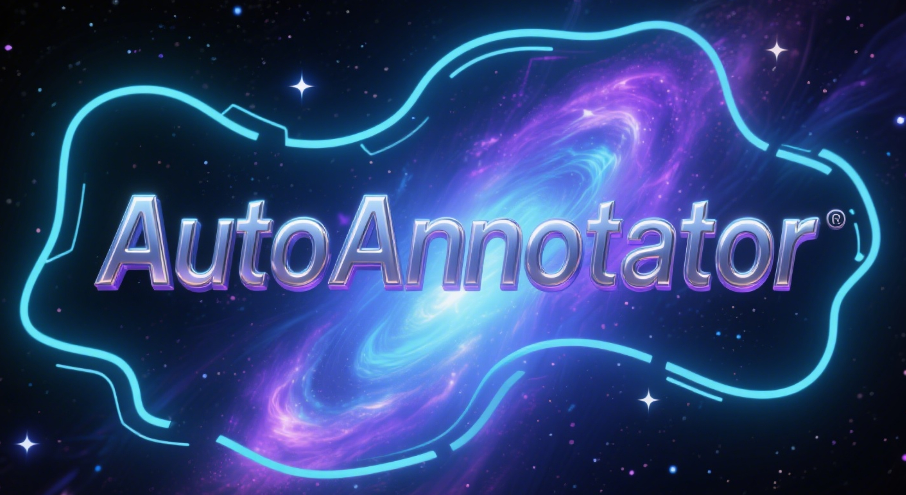
  </a>
</div>

## Introduction
Although the annotation paradigm based on Large Language Models (LLMs) has made significant breakthroughs in recent years, its actual deployment still has two core bottlenecks: first, the cost of calling commercial APIs in largescale annotation is very expensive; second, in scenarios that require fine-grained semantic understanding, such as sentiment classification and toxicity classification, the annotation accuracy of LLMs is even lower than that of Small Language Models (SLMs) dedicated to this field. To address these problems, we propose a new paradigm of multi-model cooperative annotation and design a fully automatic annotation framework AutoAnnotator based on this. Specifically, AutoAnnotator consists of two layers. The upper-level meta-controller layer uses the generation and reasoning capabilities of LLMs to select SLMs for annotation, automatically generate annotation code and verify difficult samples; the lower-level task-specialist layer consists of multiple SLMs that perform annotation through multi-model voting. In addition, we use the difficult samples obtained by the secondary review of the metacontroller layer as the reinforcement learning set and fine-tune the SLMs in stages through a continual learning strategy, thereby improving the generalization of SLMs. Extensive experiments show that AutoAnnotator outperforms existing open-source/API LLMs in zero-shot, one-shot, CoT, and majority voting settings. Notably, AutoAnnotator reduces the annotation cost by 74.15% compared to directly annotating with GPT-3.5-turbo, while still improving the accuracy by 6.21%.
## Project Exhibition
The video below is a demonstration of the operation of this project.

[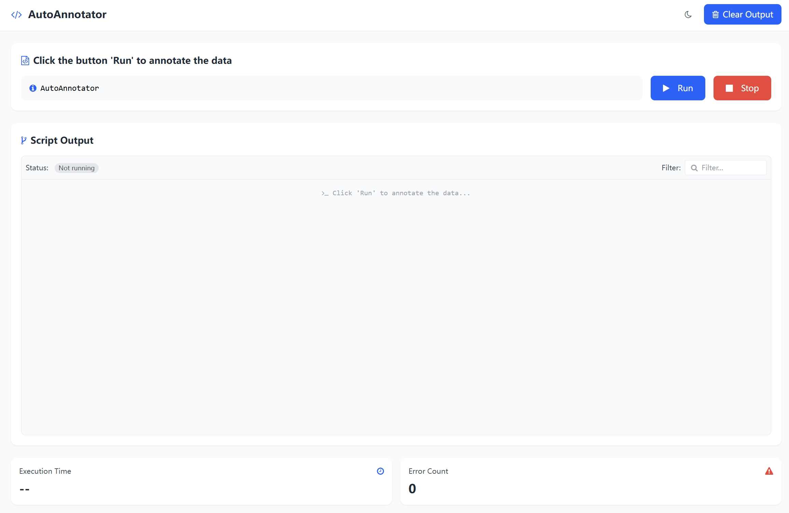](https://youtu.be/-PpDYP4CcgQ)

## Quick Start

## Architecture
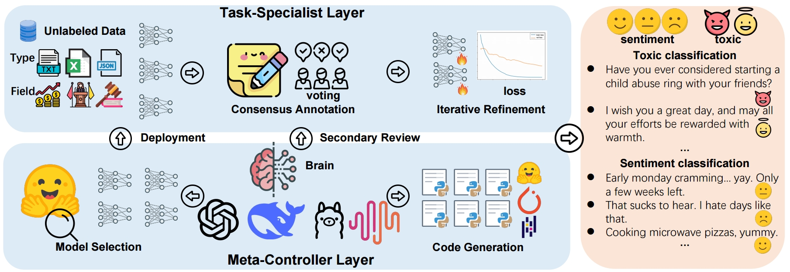

AutoAnnotator consists of two layers: a meta-controller
layer and a task-specialist layer. The meta-controller layer, powered by LLMs, is responsible for selecting
appropriate SLMs from Hugging Face, automatically generating the code required for the entire annotation process
and performing secondary review on samples that are difficult for SLMs. The task-specialist layer comprises the
selected SLMs by the meta-controller layer. SLMs use a majority voting mechanism to annotate samples and
periodically use difficult samples from LLMs for secondary review to continuously update themselves.
## Descriptions of the models choosed by LLM in the article and the datasets used for the experiments.
The models selected by the LLM in the article based on the type of annotation task.


Description of the datasets used in the article

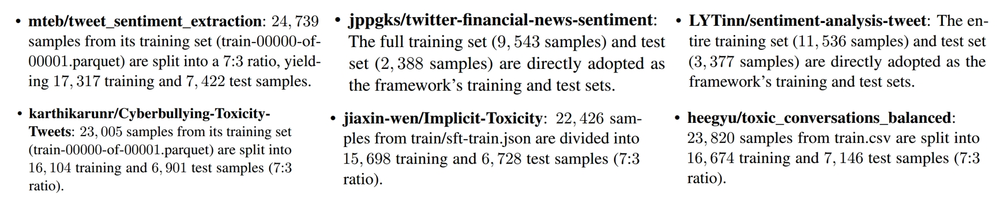

All datasets come from Hugging Face.The details are available at [src/dataset]

## Experiments

### Baselines

We evaluate AutoAnnotator on  multiple datasets. We compare AutoAnnotator against the following baselines:

- **SLMs Only:** Only use small models for data annotation.


- **Zero-shot:** Directly use LLM to label completely new, unseen categories of data.


- **One-shot:** Only provide the LLM with one or very few representative samples as a reference for labeling.


- **CoT:** Add a CoT prompt “Let’s think step by step like an operations research expert.” behind the zero-shot prompt. Make LLM perform chain thinking.


- **LLMs Vote:** Using multiple LLMs for data annotation, with a majority vote for decision-making. 

### Main Results

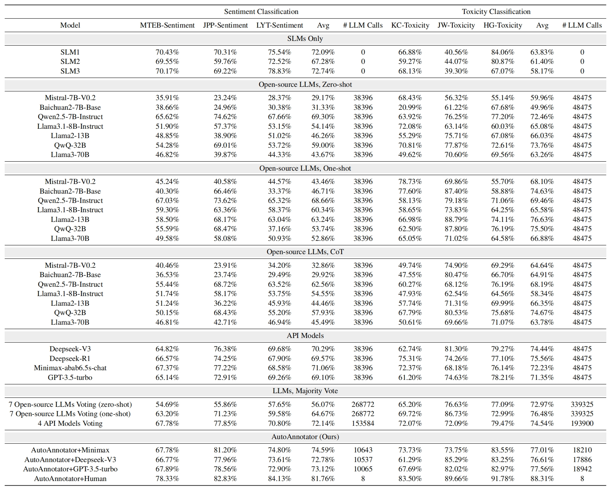

Comparison of the proposed AutoAnnotator with existing methods on different toxicity and sentiment annotation tasks. It is worth noting that the SLM1 for sentiment classification and the SLM1 for toxicity classification are not the same model. 
### Comparison of annotation cost and efficiency between closed-source LLMs and AutoAnnotator

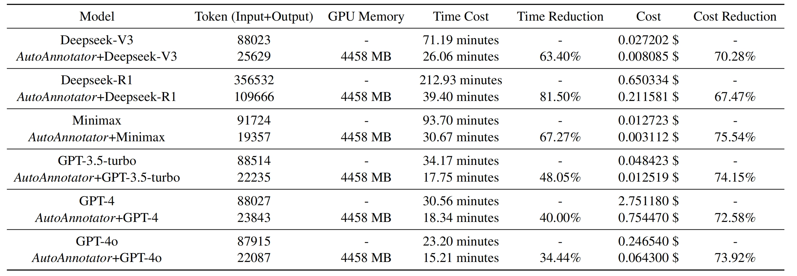

To evaluate the annotation cost and efficiency of closed-source LLMs and AutoAnnotator, we conduct a quantitative analysis from three dimensions: computing resource consumption (the number of tokens and GPU memory usage), annotation time cost, and economic cost. All experiments are performed on NVIDIA A100 GPUs, and the annotation task scale is uniformly set to 1000 samples. We conduct experiments on Deepseek-V3, DeepseekR1, Minimax, GPT-3.5-turbo, GPT-4 and GPT-4o, respectively.

### Ablation experiment
To explore the impact of the number of SLMs on the annotation performance, we perform ablations on the JPP-Sentiment dataset using GPT-3.5-turbo as the meta-controller LLM.

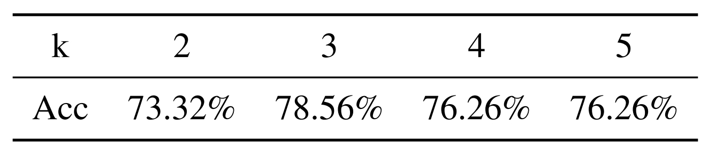

To explore the impact of the number of hard samples used for continuous fine-tuning at each stage on the annotation performance, we perform ablations on the JPP-Sentiment dataset using GPT-3.5-turbo.

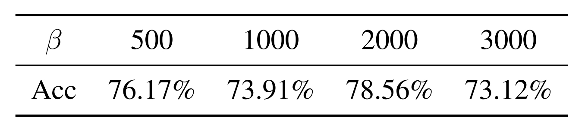
### Representative samples
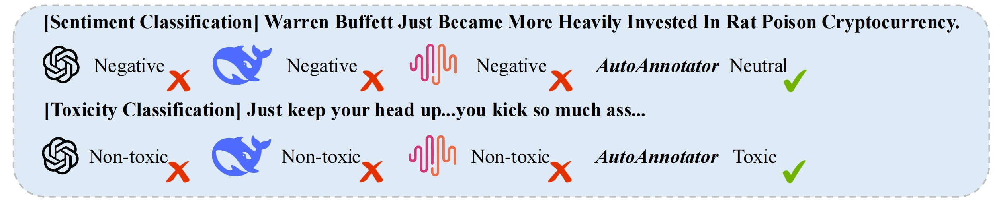

Visualization of representative samples correctly annotated by AutoAnnotator but misclassified by other closed-source LLMs
## Run Locally

### Run Pasa

```bash
git clone git@github.com:hyc2026/transformers.git
cd transformers
pip install -e .
cd ..
pip install -r requirements.txt
```

You need to first apply for a Google Search API key at [serper.dev](https://serper.dev/), and replace 'your google keys' in `utils.py`.

```python
python run_paper_agent.py
```
- The `crawler` generates the search queries from the user query and choose the expand sections from ll secondary section names of the paper.
- The `selector` takes the title and abstract of the paper as input and generates a score which indicates the relevance between the paper and user query.
- We also use google search api to search the queries generated by the `crawler` and use arxiv/ar5iv search api to get the complete paper.

## The prompts we used

System Prompt for Data Annotation

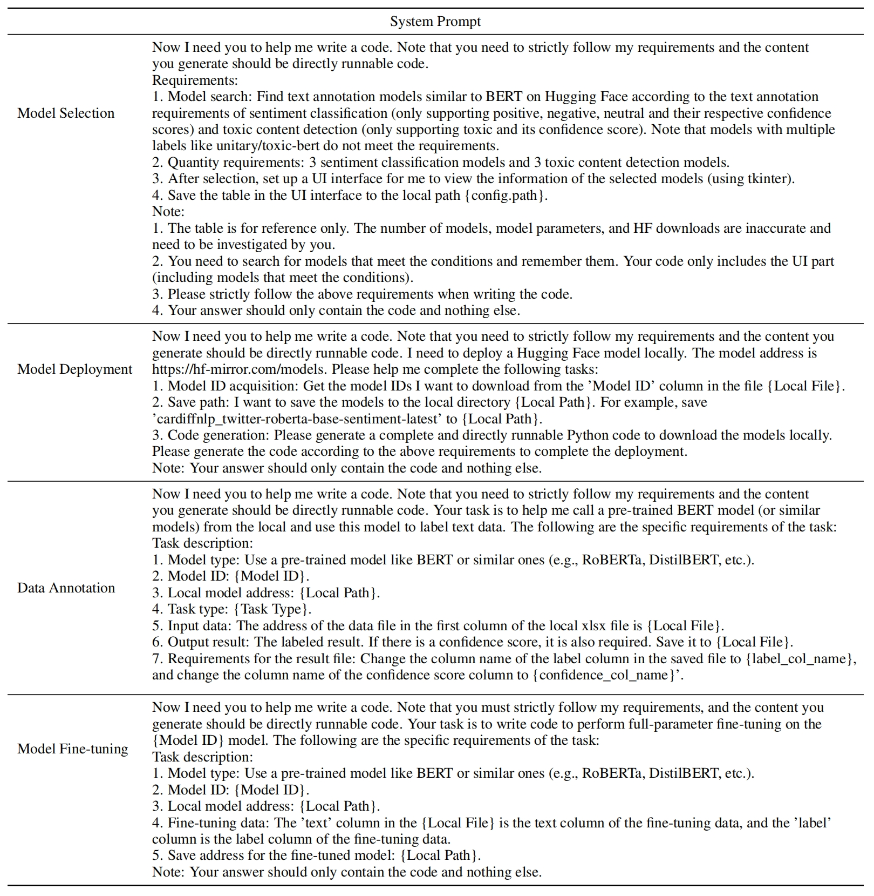

Prompt for Data Annotation

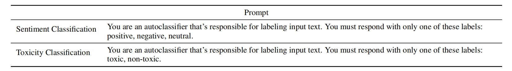

## Citation
Please cite us as:

```BibTeX
@misc{he2024pasa,
      title={PaSa: An LLM Agent for Comprehensive Academic Paper Search}, 
      author={Yichen He and Guanhua Huang and Peiyuan Feng and Yuan Lin and Yuchen Zhang and Hang Li and Weinan E},
      year={2025},
      eprint={2501.10120},
      archivePrefix={arXiv},
      primaryClass={cs.IR}
}
```
