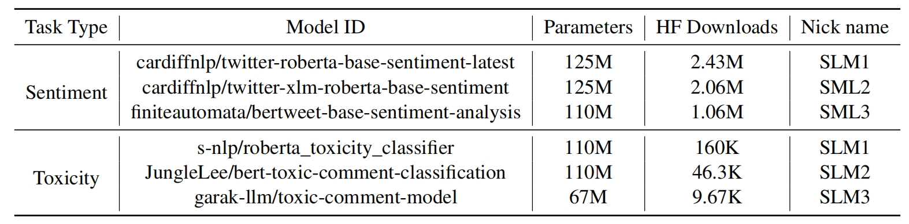

# <div align="center">AutoAnnotator<br>ACL 2025 </div>
<div align="center">


<br>

[](https://arxiv.org/abs/2501.10120)
[](https://pasa-agent.ai)
[](https://huggingface.co/bytedance-research/pasa-7b-crawler)
[](https://huggingface.co/bytedance-research/pasa-7b-selector)
[](https://huggingface.co/datasets/CarlanLark/pasa-dataset)

  <a href="https://pasa-agent.ai">
    
  </a>
</div>

## Introduction
Although the annotation paradigm based on Large Language Models (LLMs) has made significant breakthroughs in recent years, its actual deployment still has two core bottlenecks: first, the cost of calling commercial APIs in largescale annotation is very expensive; second, in scenarios that require fine-grained semantic understanding, such as sentiment classification and toxicity classification, the annotation accuracy of LLMs is even lower than that of Small Language Models (SLMs) dedicated to this field. To address these problems, we propose a new paradigm of multi-model cooperative annotation and design a fully automatic annotation framework AutoAnnotator based on this. Specifically, AutoAnnotator consists of two layers. The upper-level meta-controller layer uses the generation and reasoning capabilities of LLMs to select SLMs for annotation, automatically generate annotation code and verify difficult samples; the lower-level task-specialist layer consists of multiple SLMs that perform annotation through multi-model voting. In addition, we use the difficult samples obtained by the secondary review of the metacontroller layer as the reinforcement learning set and fine-tune the SLMs in stages through a continual learning strategy, thereby improving the generalization of SLMs. Extensive experiments show that AutoAnnotator outperforms existing open-source/API LLMs in zero-shot, one-shot, CoT, and majority voting settings. Notably, AutoAnnotator reduces the annotation cost by 74.15% compared to directly annotating with GPT-3.5-turbo, while still improving the accuracy by 6.21%.
## Project Exhibition
The video below is a demonstration of the operation of this project.

[](https://www.youtube.com/watch?v=LhXCKZyriNs)

## Quick Start

## Architecture


AutoAnnotator consists of two layers: a meta-controller
layer and a task-specialist layer. The meta-controller layer, powered by LLMs, is responsible for selecting
appropriate SLMs from Hugging Face, automatically generating the code required for the entire annotation process
and performing secondary review on samples that are difficult for SLMs. The task-specialist layer comprises the
selected SLMs by the meta-controller layer. SLMs use a majority voting mechanism to annotate samples and
periodically use difficult samples from LLMs for secondary review to continuously update themselves.
## Descriptions of the models choosed by LLM in the article and the datasets used for the experiments.
The models selected by the LLM in the article based on the type of annotation task.



Description of the datasets used in the article


All datasets come from Hugging Face.The details are available at [src/dataset]

## Experiments

### Baselines

We evaluate AutoAnnotator on  multiple datasets. We compare AutoAnnotator against the following baselines:

- **SLMs Only:** Only use small models for data annotation.


- **Zero-shot:** Directly use LLM to label completely new, unseen categories of data.


- **One-shot:** Only provide the LLM with one or very few representative samples as a reference for labeling.


- **CoT:** Add a CoT prompt “Let’s think step by step like an operations research expert.” behind the zero-shot prompt. Make LLM perform chain thinking.


- **LLMs Vote:** Using multiple LLMs for data annotation, with a majority vote for decision-making. 

### Main Results


Comparison of the proposed AutoAnnotator with existing methods on different toxicity and sentiment annotation tasks. It is worth noting that the SLM1 for sentiment classification and the SLM1 for toxicity classification are not the same model. 
## Run Locally

### Data Preparation

Download dataset from [pasa-dataset](https://huggingface.co/datasets/CarlanLark/pasa-dataset) and save it in the data folder.

```
pasa/data
├── AutoScholarQuery
│   ├── dev.jsonl
│   ├── test.jsonl
│   └── train.jsonl
├── paper_database
│   ├── cs_paper_2nd.zip
│   └── id2paper.json
├── RealScholarQuery
│   └── test.jsonl
├── sft_crawler
│   └── train.jsonl
└── sft_selector
    ├── test.jsonl
    └── train.jsonl
```

### Model Preparation

Download model checkpoints [pasa-7b-crawler](https://huggingface.co/bytedance-research/pasa-7b-crawler) and [pasa-7b-selector](https://huggingface.co/bytedance-research/pasa-7b-selector) and save it in the checkpoints folder.

```
pasa/checkpoints
├── pasa-7b-crawler
└── pasa-7b-selector
```

### Run Pasa

```bash
git clone git@github.com:hyc2026/transformers.git
cd transformers
pip install -e .
cd ..
pip install -r requirements.txt
```

You need to first apply for a Google Search API key at [serper.dev](https://serper.dev/), and replace 'your google keys' in `utils.py`.

```python
python run_paper_agent.py
```
- The `crawler` generates the search queries from the user query and choose the expand sections from ll secondary section names of the paper.
- The `selector` takes the title and abstract of the paper as input and generates a score which indicates the relevance between the paper and user query.
- We also use google search api to search the queries generated by the `crawler` and use arxiv/ar5iv search api to get the complete paper.

## Training Your Own Agent

We modify the code of `trl` and `transformers`, you can do SFT and PPO training after cloning and installing them.

[https://github.com/hyc2026/trl](https://github.com/hyc2026/trl) \
[https://github.com/hyc2026/transformers](https://github.com/hyc2026/transformers)

### Install dependencies
```bash
git clone git@github.com:hyc2026/trl.git
cd trl
pip install -e .
cd ..
git clone git@github.com:hyc2026/transformers.git
cd transformers
pip install -e .
cd ..
pip install -r requirements.txt
```

### Selector SFT Training

```bash
cd trl
accelerate launch \
    --config_file examples/accelerate_configs/deepspeed_zero3.yaml \ 
    --num_processes 8 \
    --main_process_port 2501 \
    --machine_rank 0 \
    --main_process_ip 127.0.0.1 \
    examples/scripts/sft.py \
    --model_name_or_path Qwen2.5-7B-Instruct \
    --dataset_name ../data/sft_selector/train.jsonl \
    --learning_rate 1.0e-5 \
    --num_train_epochs 1 \
    --bf16 True \
    --per_device_train_batch_size 4 \
    --gradient_accumulation_steps 1 \
    --gradient_checkpointing \
    --logging_steps 50 \
    --save_steps 2000 \
    --max_seq_length 1024 \
    --weight_decay 0.01 \
    --warmup_ratio 0.01 \
    --output_dir ../results/sft_selector \
    --attn_implementation "flash_attention_2"
```

### Crawler SFT Training
```bash
cd trl
accelerate launch \
    --config_file examples/accelerate_configs/deepspeed_zero3.yaml \ 
    --num_processes 8 \
    --main_process_port 2501 \
    --machine_rank 0 \
    --main_process_ip 127.0.0.1 \
    examples/scripts/sft.py \
    --model_name_or_path Qwen2.5-7B-Instruct \
    --dataset_name ../data/sft_crawler/train.jsonl \
    --learning_rate 1.0e-5 \
    --num_train_epochs 1 \
    --bf16 True \
    --per_device_train_batch_size 4 \
    --gradient_accumulation_steps 1 \
    --gradient_checkpointing \
    --logging_steps 50 \
    --save_steps 2000 \
    --max_seq_length 1024 \
    --weight_decay 0.01 \
    --warmup_ratio 0.01 \
    --output_dir ../results/sft_crawler \
    --attn_implementation "flash_attention_2"
```

### Crawler PPO Training

**Before Training:**

1. You need to first apply for a Google Search API key at [serper.dev](https://serper.dev/), and replace the 'your google keys' in `trl/custom_agent/search_tools.py`.
2. If you set `use_selector=True`, you need to deploy additional selector models, which can be accessed during training. Please modify `call_selector` function in `trl/custom_agent/utils.py` to call the selector and get the select results.

```bash
cd trl
accelerate launch \
    --config_file examples/accelerate_configs/deepspeed_zero3_multi.yaml \
    --main_process_port 2501 \
    --machine_rank 0 \
    --main_process_ip 127.0.0.1 \
    examples/scripts/ppo/ppo_tldr.py \
    --dataset_name ../data/AutoScholarQuery/train.jsonl \
    --dataset_test_split validation \
    --output_dir ../results/ppo_crawler \
    --learning_rate 1e-6 \
    --per_device_train_batch_size 1 \
    --gradient_accumulation_steps 4 \
    --total_episodes 16000 \
    --paper_db ../data/paper_database/cs_paper_2nd.zip \
    --paper_id ../data/paper_database/id2paper.json \
    --model_name_or_path ../output/sft_crawler \
    --sft_model_path ../output/sft_crawler \
    --reward_model_path ../output/sft_crawler \
    --local_rollout_forward_batch_size 4 \
    --num_sample_generations 0 \
    --attn_implementation "flash_attention_2" \
    --response_length 1024 \
    --stop_token eos \
    --gamma1 0.1 \
    --save_steps 10 \
    --rounds 3 \
    --use_vm True \
    --use_selector True \
    --vf_coef 10.0 \
    --expand_select_score 1.5 \
    --expand_cost 0.1 \
    --search_select_score 1.5 \
    --search_cost 0.1 \
    --num_ppo_epochs 2 \
    --kl_coef 0.1
```

## Citation
Please cite us as:

```BibTeX
@misc{he2024pasa,
      title={PaSa: An LLM Agent for Comprehensive Academic Paper Search}, 
      author={Yichen He and Guanhua Huang and Peiyuan Feng and Yuan Lin and Yuchen Zhang and Hang Li and Weinan E},
      year={2025},
      eprint={2501.10120},
      archivePrefix={arXiv},
      primaryClass={cs.IR}
}
```
